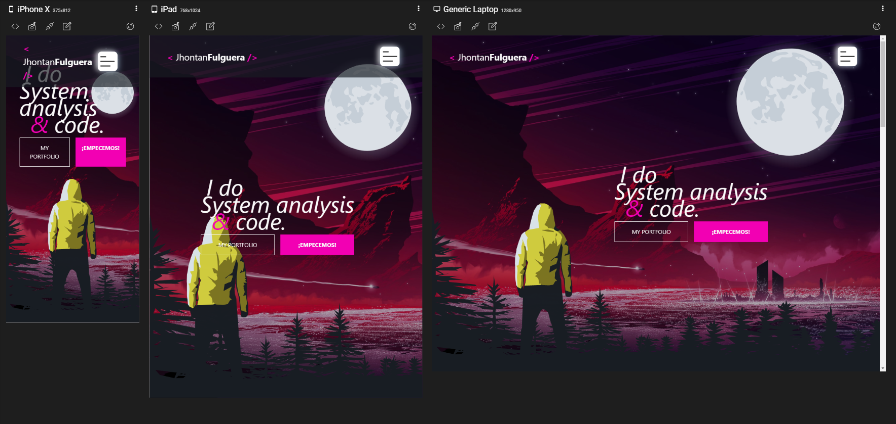

<h4 align="center">
:construction: Proyecto en construcción :construction:
</h4>
<h1 align="center"> PortFolio Web Jhonatan Fulguera </h1>

## :hammer:Funcionalidades del proyecto
- `Funcionalidad 1`: descripción de la funcionalidad 1- 
`Funcionalidad 2`: descripción de la funcionalidad 2- 
`Funcionalidad 2a`: descripción de la funcionalidade 2a relacionada con la funcionalidad 2- 
`Funcionalidad 3`: descripción de la funcionalidad 3

  

\## 🛠️ Abre y ejecuta el proyecto